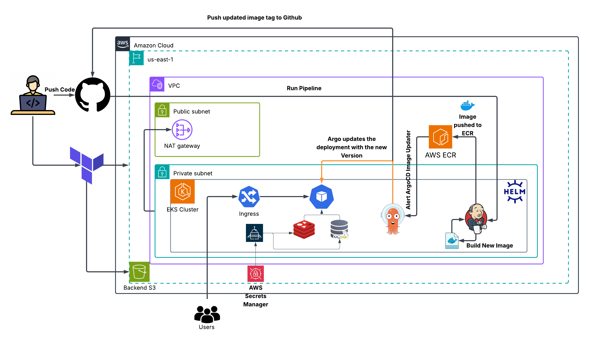
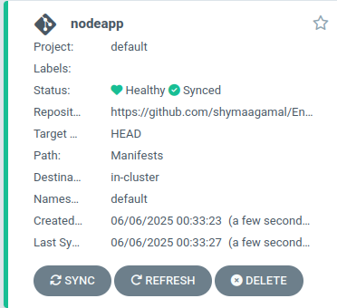
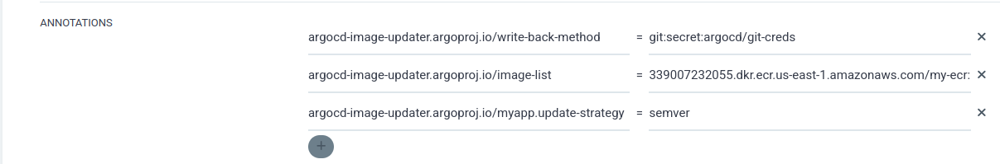
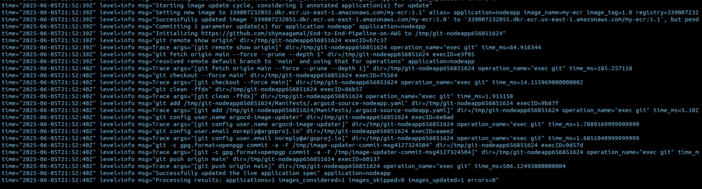
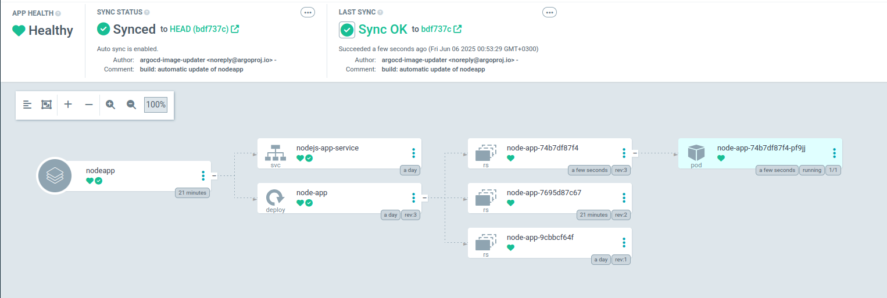
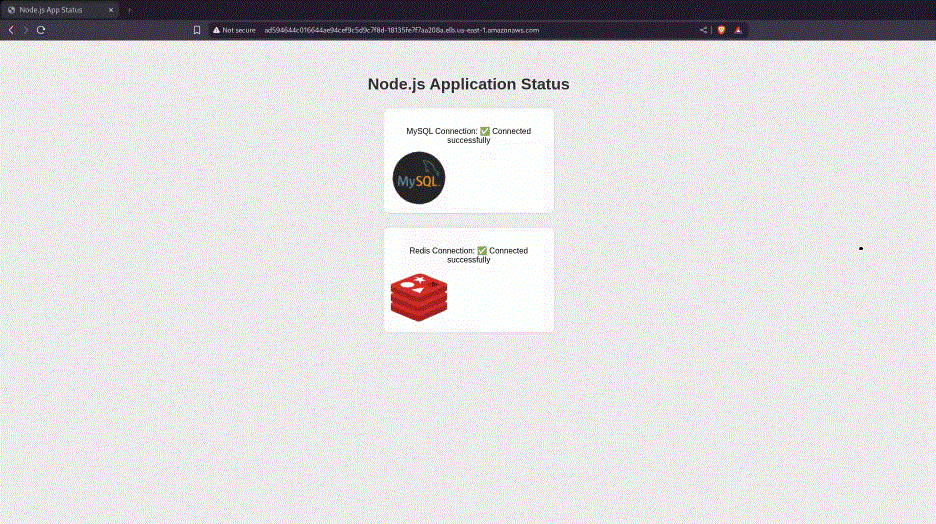

# 🚀 DevOps Capstone Project – GitOps CI/CD Pipeline on AWS

## 📘 Project Overview

This project demonstrates the creation of a **production-ready GitOps CI/CD pipeline** on AWS using modern DevOps tools. It provisions infrastructure using **Terraform**, manages CI/CD workflows using **Jenkins** and **ArgoCD**, secures sensitive information using **External Secrets Operator**, and deploys a **Node.js web application** with **MySQL** and **Redis** on **Amazon EKS**.

# 🔷 Infrastructure Architecture



# ✅ Infrastructure Provisioning – Terraform

Provisioned using only Terraform:

- **VPC** with 3 public and 3 private subnets across 3 Availability Zones.
- **NAT Gateway**, **Internet Gateway**, and **Route Tables**.

- **Amazon EKS Cluster**
  - Control Plane and Managed Node Groups inside **private subnets**.
  - **EBS CSI driver** enabled for secure service integrations and dynamic volume provisioning
- **OIDC Provider** enabled to allow secure IAM roles for Kubernetes service accounts (IRSA).

---

### ✅ Application Code Repo – NodeJs
Clone the repository to get the application code:
```bash
git clone https://github.com/MalakGhazy/nodejs-application.git
cd nodejs-application
```
> [!NOTE]
> This repository contains the full source code for the Node.js application.

### ✅ Login to EKS Cluster  
Use the following command to configure access to your EKS cluster:
```bash
aws eks update-kubeconfig --name < CLUSTER_NAME> --region <CLUSTER_REGION>
```
To ensure the cluster was added to your ~/.kube/config file:
```bash
kubectl config get-contexts 
```
> [!NOTE]
> The cluster marked with an asterisk (*) is your current default context. Use it to confirm you're working on the correct cluster.

---
## 🔐 OIDC Provider Configuration for IRSA (IAM Roles for Service Accounts)

To enable secure and fine-grained access control between Kubernetes service accounts and AWS services, we configured an OIDC (OpenID Connect) provider for the EKS cluster

### ✅ OIDC Provider Creation

Provisioned via Terraform and associated with the EKS cluster to enable IRSA.
####📁 Terraform module location:
OIDC module: [Terraform/Modules/oidc](./Terraform/Modules/oidc)

### 🔐 IAM Roles & Service Account Bindings

To securely allow Kubernetes service accounts to interact with AWS resources, we configured IAM Roles with attached policies for each service account using IRSA (IAM Roles for Service Accounts). Here are the details:

#### **External Secrets Operator (ESO)**

- **IAM Role & Service Account:** Defined in the `main.tf` file inside the [Terraform/Modules/oidc](./Terraform/Modules/oidc)

- **Permissions:** Allows ESO to fetch secrets from AWS Secrets Manager, including actions like `secretsmanager:GetSecretValue` and `secretsmanager:DescribeSecret`.

#### **EBS CSI Driver**

- **IAM Role & Service Account:** Defined inside the [Terraform/Modules/ebs_csi_driver module](./Terraform/Modules/ebs_csi_driver)
- **Permissions:** The IAM Role is attached to the AWS managed policy `AmazonEBSCSIDriverPolicy`, which grants all necessary permissions for the driver to dynamically create, attach, delete, and manage EBS volumes. This includes actions like `ec2:CreateVolume`, `ec2:AttachVolume`, and others required to manage storage lifecycle.

## 📦 EBS Storage Class Configuration

To support dynamic Persistent Volume provisioning for stateful workloads such as MySQL and Jenkins, we created a default StorageClass backed by Amazon EBS with the following configuration:

- **gp3 volume type** used for better baseline performance and cost optimization.

- Marked as the **default storage class** to allow automatic volume provisioning when no specific class is defined in PVCs.

- **volumeBindingMode**: WaitForFirstConsumer ensures volumes are created only after the pod is scheduled, ensuring proper AZ alignment.
- Used by both Jenkins (for persistent job/workspace data) and MySQL (to store database files securely).

> 📂 YAML file location: You can find the StorageClass definition in [`/Manifests/storageclass.yaml`](./Manifests/storageClass.yaml)

# ⚙️ Continuous Integration – Jenkins

This section provides detailed instructions for setting up and configuring Jenkins for Continuous Integration (CI) in the context of this repository, which implements an end-to-end CI pipeline on AWS using Jenkins, Kubernetes, and Kaniko to build and push Docker images to Amazon ECR. The setup leverages Helm for installation, configures the Jenkins UI for pipeline execution, and defines pipeline stages for code checkout and image building.

#### **Jenkins Installation and Setup via Helm**

Jenkins is deployed on an AWS EKS cluster using Helm, a Kubernetes package manager, to simplify installation and configuration. Below are the steps to install and set up Jenkins:

**Installation Steps**

*1- Add Jenkins Helm Repository:*
```bash
helm install my-jenkins bitnami/jenkins --version 13.6.8
helm repo update
```

*2-Create a Namespace:*
Jenkins will be deployed in the jenkins namespace to isolate it from other workloads.
```bash
kubectl create namespace jenkins
```

*3-Use the Provided values.yaml File:* 
The following values.yaml file is used to customize the Jenkins deployment:

Key Notes:


Image: Uses jenkins/jenkins:lts-jdk17 for a stable, long-term support version with JDK 17.


Security Context: Runs the Jenkins container as a non-root user (runAsUser: 1000, runAsGroup: 1000) for improved security.


Plugins: Installs plugins for Kubernetes integration, Git operations, pipeline support, credentials management, and AWS ECR interaction.


Jenkins URL: Configured as http://jenkins.jenkins.svc.cluster.local:8080 for internal agent communication.


Service Account: Uses the pre-existing jenkins-kaniko-sa service account, which must be configured with an IAM role for ECR access (e.g., arn:aws:iam::339007232055:role/JenkinsKanikoRole).


Service Type: LoadBalancer exposes Jenkins externally via an AWS Elastic Load Balancer (ELB) for UI access.


Persistence: Enables an 8Gi persistent volume using the gp3 storage class (AWS EBS) to store Jenkins configuration.


RBAC: Creates necessary role-based access control rules for Jenkins to interact with the Kubernetes cluster.


Agent: Enables Kubernetes agents to run pipeline jobs in pods.
Install Jenkins via Helm:
helm install jenkins jenkins/jenkins -n jenkins -f values.yaml

This deploys Jenkins in the jenkins namespace with the custom configurations.

Access Jenkins:

Get the Jenkins pod name: kubectl get pods -n jenkins.
Port-forward to access the Jenkins UI: kubectl port-forward <jenkins-pod-name> 8080:8080 -n jenkins.
Open http://localhost:8080 in your browser and log in using the admin credentials specified in values.yaml.


Verify Service Account:Ensure the service account jenkins-kaniko-sa is created and bound to the IAM role:
kubectl describe serviceaccount jenkins-kaniko-sa -n jenkins

Verify the IAM role ARN annotation is correctly set for ECR access.


Troubleshooting Installation

Pod Not Starting: Check pod events with kubectl describe pod <jenkins-pod-name> -n jenkins for resource or image pull issues.
DNS Issues: Ensure CoreDNS is running (kubectl get pods -n kube-system -l k8s-app=kube-dns) and VPC DHCP options are set to domain-name: us-east-1.compute.internal and domain-name-servers: AmazonProvidedDNS.
ECR Access: Confirm the IAM role has permissions for ecr:* actions and is associated with the service account.

Jenkins UI Configuration
To run the pipeline, configure Jenkins with the necessary plugins, credentials, and Kubernetes cloud settings. Below are the steps:
Install Required Plugins

Navigate to Manage Jenkins > Manage Plugins > Available.
Install the following plugins:
Kubernetes Plugin: Enables Jenkins to spawn agents on Kubernetes.
Git Plugin: Supports Git repository operations.
Pipeline Plugin: Enables declarative pipeline syntax.


Restart Jenkins after installation (via Manage Jenkins > Restart Safely or by restarting the pod).

Configure Kubernetes Cloud

Go to Manage Jenkins > Configure System > Cloud > Kubernetes.
Set the following:
Kubernetes URL: https://kubernetes.default.svc.cluster.local (default Kubernetes API server).
Kubernetes Namespace: jenkins.
Jenkins URL: http://jenkins.jenkins.svc.cluster.local:8080 (internal service URL for agent communication).
Jenkins Tunnel: jenkins.jenkins.svc.cluster.local:50000 (for JNLP agent connections).


Test the connection to ensure Jenkins can communicate with the EKS cluster.

Add Credentials
The pipeline requires credentials for accessing the Git repository. Configure them as follows:

Go to Manage Jenkins > Manage Credentials > System > Global credentials (unrestricted) > Add Credentials.
Add the following credential:
Kind: Username with Password
Scope: Global
Username: Your GitHub username
Password: Your GitHub personal access token (with repo scope)
ID: github-credentials (used in the pipeline)
Description: GitHub credentials for pipeline


Save the credentials. The pipeline references this ID in the git step.

Troubleshooting UI Configuration

Connection Errors: If agents cannot connect, verify the Jenkins URL and tunnel settings. Check CoreDNS status with kubectl get pods -n kube-system -l k8s-app=kube-dns.
Credential Issues: Ensure the GitHub token has the correct scope and is not expired. Test by cloning the repository manually using the token.

Jenkins Pipeline Stages
The Jenkins pipeline automates the process of checking out code from GitHub and building/pushing a Docker image to Amazon ECR. Below is an overview of the pipeline stages defined in the Jenkinsfile:
Pipeline Structure
The pipeline uses a Kubernetes agent to run tasks in a pod with kaniko and git containers. It includes environment variables and stages for checkout and image building.
Stages

Checkout:

Container: git (uses alpine/git:latest image)
Description: Clones the main branch of the repository https://github.com/shymaagamal/End-to-End-Pipeline-on-AWS.git using the github-credentials configured in Jenkins.
Purpose: Retrieves the source code, including the Dockerfile in the Application directory, for the subsequent build stage.
Implementation:stage('Checkout') {
    steps {
        container('git') {
            git branch: 'main', url: 'https://github.com/shymaagamal/End-to-End-Pipeline-on-AWS.git'
        }
    }
}


Build and Push Image:

Container: kaniko (uses gcr.io/kaniko-project/executor:debug image)
Description: Builds a Docker image from the Dockerfile located in the Application directory and pushes it to Amazon ECR with two tags: ${BUILD_NUMBER} (e.g., 1, 2, etc.) and latest.
Environment Variables:
ECR_REGISTRY: 339007232055.dkr.ecr.us-east-1.amazonaws.com (ECR registry URL).
IMAGE_REPO: my-ecr (ECR repository name).
IMAGE_TAG: ${BUILD_NUMBER} (Jenkins build number for versioning).


Purpose: Creates a Docker image and stores it in ECR for deployment or further use.
Implementation:stage('Build and Push Image') {
    steps {
        container('kaniko') {
            script {
                sh """
                    /kaniko/executor \\
                        --dockerfile=Application/Dockerfile \\
                        --context=. \\
                        --destination=${ECR_REGISTRY}/${IMAGE_REPO}:${IMAGE_TAG} \\
                        --destination=${ECR_REGISTRY}/${IMAGE_REPO}:latest \\
                        --cache=true \\
                        --cache-ttl=24h
                """
            }
        }
    }
}


Notes:
Kaniko uses the jenkins-kaniko-sa service account with IAM permissions to push to ECR.
The --cache option enables Docker layer caching to speed up builds.
The --cache-ttl=24h ensures cached layers are valid for 24 hours.


Post-Build Actions

Always: Prints "Build completed" to the console.
Success: Prints "Image pushed successfully to ${ECR_REGISTRY}/${IMAGE_REPO}:${IMAGE_TAG}".
Failure: Prints "Build failed".
Implementation:post {
    always {
        echo "Build completed"
    }
    success {
        echo "Image pushed successfully to ${ECR_REGISTRY}/${IMAGE_REPO}:${IMAGE_TAG}"
    }
    failure {
        echo "Build failed"
    }
}


Troubleshooting Pipeline

Checkout Stage:
Error: "Repository not found" or authentication failure.
Fix: Verify github-credentials ID exists and the token is valid. Check repository URL and branch name.


Build and Push Stage:
Error: Kaniko fails to push to ECR (e.g., authentication errors).
Fix: Ensure jenkins-kaniko-sa has the correct IAM role with ecr:* permissions. Verify AWS_DEFAULT_REGION is set correctly (us-east-1).
Error: Dockerfile not found.
Fix: Confirm Application/Dockerfile exists in the repository root.


DNS Issues: If the pod fails with UnknownHostException for jenkins.jenkins.svc.cluster.local, check CoreDNS (kubectl get pods -n kube-system -l k8s-app=kube-dns) and VPC DHCP options in the AWS console.

Additional Notes

Security: Store sensitive data like the Jenkins admin password and GitHub token securely, preferably using a secret manager or Kubernetes secrets.
Scaling: For production, consider enabling Jenkins high availability (HA) or increasing resource limits in values.yaml.
Monitoring: Use tools like Prometheus and Grafana to monitor Jenkins and EKS cluster health.
References:
Jenkins Helm Chart
Kubernetes Plugin for Jenkins
AWS EKS Documentation
Kaniko Documentation


This setup ensures a robust CI pipeline for building and deploying Docker images to ECR, with clear instructions for replication and troubleshooting.


-----> jenkins part

- installations and setup via Helm and mentions to values.yaml if used
- Jenkins UI Configuration and mentions to credentials that u used in pipeline
- Jenkins Pipeline stages

# 🚀 Continuous Deployment – ArgoCD + Argo Image Updater

- Create ArgoCD namespace

```bash
kubectl create ns argocd
```

- ArgoCD installation via Helm

```bash
helm repo add argo https://argoproj.github.io/argo-helm
helm install -n argocd argocd argo/argo-cd --version 8.0.14
```

- Get ArgoCD initial password

```bash
kubectl -n argocd get secret argocd-initial-admin-secret -o jsonpath="{.data.password}" | base64 -d
```

- Setup ArgoCD application



- Install ArgoCD image updater with values

```bash
helm install -n argocd argocd-image-updater argo/argocd-image-updater --version 0.12.2 -f Helm/argo_imageupdater_values.yaml
```

- Add image updater annotations

```yaml
argocd-image-updater.argoproj.io/write-back-method: git:secret:argocd/git-creds
argocd-image-updater.argoproj.io/image-list: 339007232055.dkr.ecr.us-east-1.amazonaws.com/my-ecr:1.x
argocd-image-updater.argoproj.io/myapp.update-strategy: semver
```



- Wait For the image update event



- ArgoCD pushes the new version to Github and updates the Deployment




# 🔐 External Secrets Operator with AWS Secrets Manager

This guide explains how to set up the **External Secrets Operator** with **AWS Secrets Manager** to automatically sync secrets into your Kubernetes cluster.

---

## 🛠️ **Installation**

### 1️⃣ **Add the Helm Repository:**

```bash
helm repo add external-secrets-operator https://charts.external-secrets.io/
```

### 2️⃣ **Install the External Secrets Operator:**

```bash
helm install external-secrets external-secrets/external-secrets \
  -n external-secrets --create-namespace \
  --set serviceAccount.name=external-secrets \
  --set serviceAccount.annotations."eks\.amazonaws\.com/role-arn"=arn:aws:iam::<ACCOUNT_ID>:role/external-secrets-irsa\
  --set installCRDs=true
```

### 3️⃣ **Verify Installation:**

```bash
kubectl get pods -n external-secrets
```

---

## 🔐 **Connect to AWS Secrets Manager**

### 1️⃣ **Export the AWS Credentials**

```bash
export AWS_ACCESS_KEY_ID=$(aws configure get aws_access_key_id --profile default)
export AWS_SECRET_ACCESS_KEY=$(aws configure get aws_secret_access_key --profile default)

```

### 2️⃣ **Create a Kubernetes Secret with AWS Credentials**

Now, create a Kubernetes secret containing your AWS access credentials:

```bash
kubectl create secret generic aws-credentials \
  -n external-secrets \
  --from-literal=access-key-id=$AWS_ACCESS_KEY_ID \
  --from-literal=secret-access-key=$AWS_SECRET_ACCESS_KEY
```

---

### 3️⃣ **Create a ClusterSecretStore**

Now, Apply the K8s Manifests

```bash
kubectl apply -f k8s/secrets
```

## ✅ **Verify the Synced Secret**

You can verify that the secret has been synced successfully by checking the secret in your Kubernetes cluster:

```bash
kubectl get secrets
```

## ✅ **Verify the Secret has right values**

You can verify that the secret has the same values in the secret manager in your Kubernetes cluster :

```bash
kubectl get secret <SECRET_NAME>  -o jsonpath="{.data}" | jq 'to_entries[] | "\(.key): \(.value | @base64d)"'
```

---

## 🛠 **Using the Secrets in Your Application**

Now, in your _Deployment_ manifest, reference the synced secret:

```yaml
env:
  - name: DB_USERNAME
    valueFrom:
      secretKeyRef:
        name: mysql-k8s-secret
        key: username
  - name: DB_PASSWORD
    valueFrom:
      secretKeyRef:
        name: mysql-k8s-secret
        key: password
```

---

This setup will allow the **External Secrets Operator** to automatically sync secrets from **AWS Secrets Manager** into your Kubernetes cluster and make them available to your applications securely.

# 🐍 Application – Node.js + MySQL + Redis

This section describes the deployment process for a Node.js web application integrated with MySQL and Redis inside the EKS cluster.

### 🛢️ 1. MySQL Deployment via Bitnami Helm Chart

**🧪 Authentication Prerequisite**

Before installing the MySQL Helm chart from DockerHub OCI registry, authenticated using:

```bash
helm registry login registry-1.docker.io
Username: <your_dockerhub_username>
Password: <your_dockerhub_password_or_token>

```

**📦 Installation Command**

```bash
helm install my-mysql oci://registry-1.docker.io/bitnamicharts/mysql -f mysql_values.yaml --namespace default
```

**⚙️ mysql Configuration**

To securely configure MySQL authentication within your Kubernetes cluster, we use Terraform, AWS Secrets Manager, and the Bitnami MySQL Helm chart together. The Helm chart expects specific secret key names, and we make sure those are correctly provided via automation.

**✅ Required Secret Keys (Expected by Bitnami MySQL Chart)**

- The Bitnami chart is designed to look for a Kubernetes Secret with the following keys:
  `mysql-root-password`,`mysql_hostname`,`mysql-username`,`mysql-password`,`mysql_port`
- so we use `mysql_values.yaml` to override default Bitnami MySQL Helm chart settings. It instructs the chart to use an existing Kubernetes Secret `mysql-k8s-secret` and maps specific keys for the credentials.

📁 File Location: [Helm/mysql_values.yaml](./Helm/mysql_values.yaml)

✅ Validation
Verified the MySQL deployment using a MySQL client pod:

```bash
kubectl run my-mysql-client --rm --tty -i --restart='Never' --image  docker.io/bitnami/mysql:9.3.0-debian-12-r0 --namespace default --env MYSQL_ROOT_PASSWORD=$MYSQL_ROOT_PASSWORD --command -- bash
```

### ⚡ 2. Redis Deployment

**📦 Installation Command**

```bash
helm install redis bitnami/redis --set auth.enabled=false --namespace default
```

We created a secret containing the Redis hostname and port, which is injected as environment variables into the Node.js application to enable seamless connection to the Redis service.

### 🔧 3. Node.js Application

#### **📁 Application Directory Structure**

The application source code and Dockerfile are located under the [Applications](./Applications) directory.

#### **🐳 Docker Image Build & Push to ECR**

To containerize the application and push it to Amazon Elastic Container Registry (ECR), the following steps were executed:

1. **Authenticate Docker with ECR:**

```bash
aws ecr get-login-password --region us-east-1 | docker login --username AWS --password-stdin 339007232055.dkr.ecr.us-east-1.amazonaws.com
```

2. Build and Push Image to ECR:

```bash
# Build the Docker image from the Application directory
docker build -t my-ecr/nodejs-mysql-redis ./Application

# Tag the image for ECR
docker tag my-ecr/nodejs-mysql-redis:latest 339007232055.dkr.ecr.us-east-1.amazonaws.com/my-ecr:latest

# Push the image to ECR
docker push 339007232055.dkr.ecr.us-east-1.amazonaws.com/my-ecr:latest

```

> This image is later pulled by the Kubernetes deployment running inside EKS.

#### 🚀 Deployment via Kubernetes

- The deployment manifest for the Node.js application is defined under the [Manifests](./Manifests) directory.
- This includes:
  - **nodejs_deployment.yaml:** Defines the Kubernetes Deployment for the Node.js app.
  - **service.yaml:** Defines the Service resource with LoadBalancer type to expose the application externally.

#### 🔐 Environment Variables and Secrets Integration

- The application requires environment variables to connect to MySQL and Redis.
- These values (such as `MYSQL_HOST`, `MYSQL_USER`, `MYSQL_PASSWORD`, etc.) are securely sourced from Kubernetes Secrets and injected into the Node.js pod to enable seamless connectivity to these backend services.
- The secrets themselves are dynamically synced from **AWS Secrets Manager** using the **External Secrets Operator (ESO).**

## 🌐 Application Access



---

# References:
[Artifact hub - Jenkins](https://artifacthub.io/packages/helm/bitnami/jenkins)
[Github - Kaniko](https://github.com/GoogleContainerTools/kaniko)
[Artifact hub - External Operator](https://artifacthub.io/packages/Helm/external-secrets-operator/external-secrets?modal=install) <br>
[External Secrets Operator](https://external-secrets.io/latest/)
